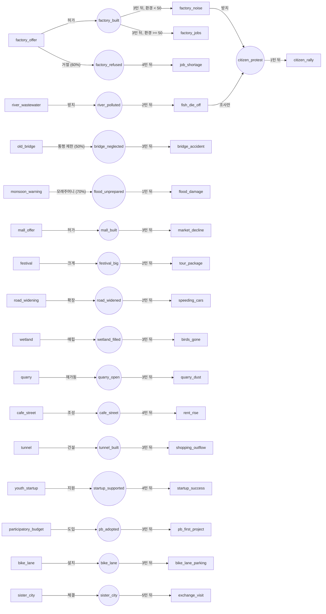

# EVENT_CATALOG.md — 사건 목록 (초안 v3)

## 0. 작성 규칙

- **모든 사건은 한 판에 최대 1회만 등장**한다. 주제가 겹치는 사건은 만들지 않는다.
- 사건 분류

  ```
  사건
  ├─ 일반 사건         조건 없음. 무작위로 등장
  └─ 조건부 사건       조건을 만족하면 일반 사건보다 먼저 등장
     ├─ 상태·턴 조건 사건   특정 수치나 턴에 도달하면 등장 (위기 사건 포함)
     └─ 지연 사건           특정 사건의 선택으로 켜진 플래그가 N턴 지나면 등장
  ```

  - 매 턴, 조건을 만족하는 조건부 사건이 있으면 그것이 나온다. 없으면 일반 사건 중 하나가 무작위로 나온다.
  - 두 하위 분류는 데이터의 `kind` 필드(`state` / `delayed`)로 구분한다. 게임 로직은 둘을 똑같이 "조건 검사 → 통과 시 등장"으로 처리하고, `kind`는 문서 정리와 데이터 검증에만 쓴다. (예: `delayed`인데 플래그 경과 턴 조건이 없으면 검증 오류)
  - 지연 사건의 "N턴 뒤"는 **"플래그가 켜진 지 N턴 이상"** 조건으로 표현한다. 지연 사건도 상태 조건을 함께 가질 수 있다. (예: 공장 허가 3턴 뒤, 그때 환경이 50 미만이면 소음 민원)
  - 여러 조건부 사건이 동시에 조건을 만족하면 `priority`가 높은 것 하나만 나온다.

    | 종류 | priority |
    |---|---|
    | 위기 사건 | 100 |
    | 지연 사건 | 50 |
    | 턴 조건 사건 | 40 |
    | 높은 상태 조건 사건 | 30 |

- 한 선택지 안에서 상태별 증감 폭은 서로 달라도 된다. (예: 환경 -10, 주민 +4)
- 한 선택지는 **1~3개 상태**만 건드린다. 네 상태를 모두 건드리는 선택지는 만들지 않는다.
- 좌/우 선택지의 **영향 상태 조합이 서로 다르게** 만든다. 화면 힌트(영향받는 상태만 표시)가 판단 근거가 되도록.
- 힌트에는 즉시 효과만 드러난다. 플래그와 그로 인한 지연 사건은 드러나지 않는다.
- 초등학생 대상이므로 **난이도는 완만하게**: 효과 폭은 대부분 2~10, 큰 효과도 15 이하.
- 지연 사건이 항상 나쁜 결과인 것은 아니다. 좋은 결과로 이어지는 지연 사건도 섞는다. (예: `startup_success`)
- 수치는 초안이며 밸런스 시뮬레이션 후 조정한다.

**약어**: 주 = 주민 / 재 = 재정 / 환 = 환경 / 안 = 안전
**최대 턴**: 30 (설정값)

**사건 수 기준 (회차 플레이 전제)**

- 한 판 30턴 중 조건부 사건이 대략 6~10턴을 차지하므로, 일반 사건은 한 판에 20~24개 정도 나온다.
- 일반 사건 풀을 **60개**로 두면 한 판에 풀의 35~40%만 보게 된다. 두 판을 연달아 해도 겹치는 일반 사건은 평균 8개 안팎이다.
- 지연 사건은 선택에 따라 달라지므로 판마다 다른 조합이 나온다.

**현재 수량**: 일반 60 / 조건부 28 (지연 18, 상태·턴 조건 10) = **총 88개**

---

## 1. 일반 사건 (60개)

**태그 분포**: 환경 9 / 안전 9 / 복지 9 / 행정 9 / 산업 8 / 교통 8 / 문화 8

### 1.1 환경 (9)

| # | id | 제목 · 상황 | 왼쪽 선택 | 효과 | 오른쪽 선택 | 효과 | 플래그 |
|---|---|---|---|---|---|---|---|
| 2 | vacant_lot | **빈 땅의 쓰임새** — 마을 중심 빈 땅을 어떻게 쓸지 결정 | 공원을 만든다 | 환 +8, 재 -6, 주 +3 | 공영 주차장을 만든다 | 재 +4, 안 +3, 환 -7 | 좌: `park_built` |
| 6 | trash_site | **쓰레기 처리장** — 기존 처리장이 곧 가득 참 | 마을 안에 새로 짓는다 | 재 -5, 환 +6, 주 -7 | 이웃 마을에 비용을 내고 맡긴다 | 재 -9, 주 +2 | — |
| 7 | river_wastewater | **하천에 흘러드는 폐수** — 상류 작업장에서 폐수 유입 의심 | 단속을 강화한다 | 재 -4, 주 -5, 환 +7 | 당분간 지켜본다 | 환 -8, 주 +2 | 우: `river_polluted` |
| 11 | solar_farm | **산비탈 태양광** — 업체가 산비탈에 태양광 발전소 설치 제안 | 허가한다 | 재 +8, 환 -4, 주 -3 | 거절한다 | 주 +3 | — |
| 15 | street_trees | **가로수 뿌리** — 가로수 뿌리가 보도블록을 들어 올림 | 나무를 베어 낸다 | 환 -7, 안 +4, 주 +2 | 나무를 살리고 보도를 새로 깐다 | 재 -8, 환 +2 | — |
| 19 | recycling_rules | **엉망인 분리배출** — 재활용품이 일반 쓰레기로 버려지고 있음 | 규칙을 엄격히 하고 어기면 과태료를 물린다 | 환 +7, 주 -5, 재 +2 | 안내와 홍보만 한다 | 재 -3, 환 +2 | — |
| 20 | wetland | **마을 끝 습지** — 습지를 메워 농지로 쓰자는 요청 | 습지를 그대로 보존한다 | 환 +5, 주 -4 | 메워서 농지로 만든다 | 재 +7, 환 -9, 주 +3 | 우: `wetland_filled` |
| 21 | disposable_cups | **넘쳐나는 일회용 컵** — 가게마다 일회용 컵 사용이 많음 | 다회용 컵 대여 사업을 지원한다 | 재 -6, 환 +6 | 가게 자율에 맡긴다 | 주 +2, 환 -3 | — |
| 22 | hill_trail | **뒷산 둘레길** — 뒷산에 산책로를 만들어 달라는 요청 | 둘레길을 만든다 | 재 -5, 주 +6, 환 -3 | 숲을 그대로 둔다 | 환 +3, 주 -2 | — |

### 1.2 안전 (9)

| # | id | 제목 · 상황 | 왼쪽 선택 | 효과 | 오른쪽 선택 | 효과 | 플래그 |
|---|---|---|---|---|---|---|---|
| 5 | old_bridge | **낡은 다리** — 점검 결과 다리 곳곳에 균열 발견 | 당장 보수한다 | 재 -11, 안 +10 | 통행만 제한한다 | 주 -5, 안 -3 | 우: `bridge_neglected`(50%) |
| 8 | alley_cctv | **골목 CCTV** — 어두운 골목에 CCTV 설치 요청 | 설치한다 | 재 -7, 안 +8, 주 -3 | 설치하지 않는다 | 주 +3, 안 -5 | — |
| 12 | monsoon_warning | **장마 예보** — 올여름 폭우가 잦을 것이라는 예보 | 배수로를 정비한다 | 재 -9, 안 +9 | 모래주머니만 준비한다 | 재 -2 | 우: `flood_unprepared`(70%) |
| 14 | school_zone | **어린이 보호구역** — 학교 앞 속도 제한 구역 확대 요청 | 구역을 넓힌다 | 안 +8, 주 -4, 재 -3 | 지금대로 둔다 | 주 +2, 안 -5 | — |
| 17 | fire_station | **먼 소방서** — 불이 나면 소방차 도착까지 오래 걸림 | 소방 분소를 유치한다 | 재 -12, 안 +11 | 의용소방대를 꾸린다 | 재 -3, 안 +4, 주 -3 | — |
| 23 | old_playground | **녹슨 놀이기구** — 놀이터 기구 여러 개가 낡고 녹슮 | 새 기구로 모두 교체한다 | 재 -8, 안 +7, 주 +2 | 위험한 기구만 철거한다 | 안 +3, 주 -5 | — |
| 24 | quake_drill | **지진 대피 훈련** — 마을 전체 훈련을 하려면 한나절 가게 문을 닫아야 함 | 마을 전체가 훈련한다 | 안 +8, 주 -4 | 학교에서만 훈련한다 | 안 +3 | — |
| 25 | stray_dogs | **떠돌이 개** — 떠돌이 개 무리에 놀란 아이들 | 마을 보호소를 만든다 | 재 -6, 안 +4, 주 +2 | 붙잡아 다른 지역 보호소로 보낸다 | 안 +5, 주 -4 | — |
| 26 | icy_roads | **겨울 빙판길** — 눈이 오면 비탈길이 빙판이 됨 | 제설 장비를 산다 | 재 -9, 안 +8 | "내 집 앞 눈 치우기" 캠페인을 한다 | 안 +3, 주 -4 | — |

### 1.3 복지 (9)

| # | id | 제목 · 상황 | 왼쪽 선택 | 효과 | 오른쪽 선택 | 효과 | 플래그 |
|---|---|---|---|---|---|---|---|
| 9 | center_floor | **주민센터 빈 층** — 비어 있는 한 층의 쓰임을 결정 | 경로당으로 꾸민다 | 주 +5, 재 -4, 안 +2 | 사무실로 임대한다 | 재 +7, 주 -3 | — |
| 45 | shared_childcare | **공동 육아 나눔터** — 부모들이 아이를 함께 돌볼 공간을 요청 | 나눔터를 연다 | 재 -6, 주 +7 | 지금은 어렵다고 답한다 | 주 -3 | — |
| 46 | access_ramp | **가게 앞 계단** — 휠체어 이용 주민이 가게에 들어가기 어려움 | 경사로 설치비를 지원한다 | 재 -5, 안 +3, 주 +2 | 가게 자율에 맡긴다 | 주 -3 | — |
| 47 | after_school | **방과 후 돌봄교실** — 돌봄교실 대기 인원이 너무 많음 | 교실을 늘린다 | 재 -7, 주 +4, 안 +4 | 지금 규모를 유지한다 | 주 -4 | — |
| 48 | clinic_hours | **보건소 진료 시간** — 퇴근 후 진료받을 곳이 없다는 민원 | 야간 진료를 연다 | 재 -8, 주 +6 | 지금대로 운영한다 | 안 -3 | — |
| 49 | sharing_fridge | **나눔 냉장고** — 남는 음식을 나누는 냉장고 설치 제안 | 설치한다 | 재 -3, 주 +4, 환 +2 | 관리가 어려워 설치하지 않는다 | 환 -2, 주 -2 | — |
| 50 | language_class | **한국어 교실** — 이주민 가정이 한국어 교실을 요청 | 마을에서 교실을 연다 | 재 -5, 주 +5 | 자원봉사자를 모집해 맡긴다 | 주 +2 | — |
| 51 | youth_rent | **청년 월세 부담** — 청년들이 비싼 월세 때문에 떠나려 함 | 월세를 지원한다 | 재 -8, 주 +6 | 대신 청년 공공주택을 짓는다 | 재 -4, 환 -3, 주 +3 | — |
| 52 | public_bath | **동네 목욕탕 폐업** — 오래된 목욕탕이 문을 닫는다며 인수를 요청 | 공공 목욕탕으로 인수한다 | 재 -7, 주 +5 | 철거하고 주차장으로 쓴다 | 재 +3, 안 +2, 주 -4 | — |

### 1.4 행정 (9)

| # | id | 제목 · 상황 | 왼쪽 선택 | 효과 | 오른쪽 선택 | 효과 | 플래그 |
|---|---|---|---|---|---|---|---|
| 18 | old_houses | **오래된 주택가** — 낡은 주택가 재개발 요구 | 재개발을 허가한다 | 재 +10, 안 +5, 주 -9 | 보존하고 수리비를 지원한다 | 재 -6, 주 +4 | — |
| 53 | participatory_budget | **주민참여예산** — 예산 일부를 주민이 직접 정하게 하자는 제안 | 도입한다 | 주 +5, 재 -4 | 지금처럼 전문가가 정한다 | 재 +3 | 좌: `pb_adopted` |
| 54 | town_hall_move | **비좁은 마을회관** — 회관이 좁아 이전 요구 | 외곽 넓은 땅으로 옮긴다 | 재 +5, 환 -4, 주 -3 | 제자리에서 고쳐 쓴다 | 재 -7, 안 +3 | — |
| 55 | online_services | **민원 온라인화** — 서류 발급을 모두 온라인으로 바꾸자는 제안 | 온라인 중심으로 바꾼다 | 재 +6, 주 -4, 환 +2 | 창구와 온라인을 함께 운영한다 | 재 -4, 주 +3 | — |
| 56 | move_in_bonus | **줄어드는 인구** — 이사 오는 사람보다 떠나는 사람이 많음 | 전입 장려금을 준다 | 재 -9, 주 +7 | 빈집을 고쳐 싸게 빌려준다 | 재 -5, 주 +3, 안 +2 | — |
| 57 | leash_rule | **반려견 목줄** — 목줄 없는 개 때문에 다툼이 잦음 | 규칙을 만들고 과태료를 물린다 | 안 +6, 주 -3 | 안내와 홍보만 한다 | 주 +2 | — |
| 58 | rename_town | **마을 이름 바꾸기** — 홍보를 위해 새 이름을 짓자는 의견 | 새 이름으로 바꾼다 | 재 +4, 주 -5 | 정든 이름을 지킨다 | 주 +3 | — |
| 59 | trash_bag_price | **쓰레기봉투 가격** — 처리 비용이 올라 봉투 가격 인상 검토 | 가격을 올린다 | 재 +7, 환 +3, 주 -6 | 가격을 그대로 둔다 | 주 +2, 재 -4 | — |
| 60 | greenbelt | **개발 제한 구역** — 땅 주인들이 개발 제한을 풀어 달라고 요청 | 제한을 푼다 | 재 +10, 환 -9, 주 +2 | 제한을 유지한다 | 환 +3, 주 -4 | — |

### 1.5 산업 (8)

| # | id | 제목 · 상황 | 왼쪽 선택 | 효과 | 오른쪽 선택 | 효과 | 플래그 |
|---|---|---|---|---|---|---|---|
| 1 | factory_offer | **새로운 공장** — 기업이 마을 외곽에 공장을 짓겠다고 제안 | 허가하지 않는다 | 재 -4, 주 -3 | 공장 건설을 허가한다 | 재 +12, 환 -10, 주 +4 | 좌: `factory_refused`(60%) / 우: `factory_built` |
| 13 | mall_offer | **대형마트 입점** — 대형마트가 마을 입구에 들어오겠다고 제안 | 허가한다 | 재 +9, 주 +4, 환 -3 | 거절하고 전통시장을 지원한다 | 재 -6, 주 +2 | 좌: `mall_built` |
| 27 | local_food | **로컬푸드 직매장** — 농민들이 직접 파는 매장을 지어 달라고 요청 | 직매장을 짓는다 | 재 -7, 주 +5, 환 +2 | 기존 마트에 맡긴다 | 주 -4 | — |
| 28 | smart_farm | **대형 스마트팜** — 기업이 농지를 빌려 대형 온실 단지를 짓겠다고 제안 | 허가한다 | 재 +9, 주 -5, 환 -2 | 거절하고 작은 농가를 지원한다 | 재 -5, 주 +4 | — |
| 29 | youth_startup | **빈 상가** — 비어 가는 상가에 청년 가게를 들이자는 제안 | 청년 가게 월세를 지원한다 | 재 -7, 주 +4 | 그대로 둔다 | 안 -3, 주 -2 | 좌: `startup_supported` |
| 30 | delivery_hub | **물류센터** — 택배 회사가 물류센터를 짓겠다고 제안 | 유치한다 | 재 +10, 안 -5, 환 -4 | 거절한다 | 환 +2, 주 -2 | — |
| 31 | quarry | **채석장 재가동** — 문 닫은 채석장을 다시 열자는 요청 | 재가동을 허가한다 | 재 +8, 주 +3, 환 -7 | 공원으로 복원한다 | 재 -8, 환 +6 | 좌: `quarry_open` |
| 32 | cafe_street | **카페 거리** — 조용한 골목을 카페 거리로 꾸미자는 제안 | 카페 거리를 만든다 | 재 +6, 주 +5, 안 -2 | 주택 골목으로 둔다 | 안 +2, 주 -2 | 좌: `cafe_street` |

### 1.6 교통 (8)

| # | id | 제목 · 상황 | 왼쪽 선택 | 효과 | 오른쪽 선택 | 효과 | 플래그 |
|---|---|---|---|---|---|---|---|
| 4 | road_widening | **좁은 중심 도로** — 출퇴근 정체와 보행 사고 위험 | 지금 도로를 유지한다 | 안 -5, 주 -2 | 도로를 넓힌다 | 재 -12, 안 +7, 환 -5 | 우: `road_widened` |
| 10 | bus_route | **적자 버스 노선** — 외곽 노선 승객이 적어 적자 누적 | 노선을 유지한다 | 재 -8, 주 +4 | 노선을 폐지한다 | 재 +6, 주 -8, 환 -2 | — |
| 33 | bike_lane | **자전거 도로** — 차로 하나를 자전거 도로로 바꾸자는 제안 | 자전거 도로를 만든다 | 환 +6, 재 -5, 주 -3 | 차로를 그대로 둔다 | 주 +2, 환 -2 | 좌: `bike_lane` |
| 34 | illegal_parking | **상가 앞 불법 주차** — 불법 주차로 보행자가 위험함 | 강하게 단속한다 | 안 +6, 주 -5, 재 +3 | 주차 가능 시간을 정해 준다 | 주 +3, 안 -3 | — |
| 35 | train_stop | **기차역 정차** — 기차가 서게 하려면 마을도 비용을 나눠 내야 함 | 비용을 내고 역을 유치한다 | 재 -13, 주 +8, 환 +2 | 포기한다 | 주 -5 | — |
| 36 | tunnel | **산 너머 도시** — 산을 뚫어 이웃 도시와 잇는 터널 계획 | 터널을 뚫는다 | 재 -10, 주 +7, 환 -8 | 옛길을 유지한다 | 주 -3, 환 +2 | 좌: `tunnel_built` |
| 37 | ev_chargers | **전기차 충전소** — 공영 주차장 일부를 충전 구역으로 바꾸자는 요청 | 충전소를 설치한다 | 환 +4, 재 -4, 주 -3 | 나중으로 미룬다 | 주 +2, 환 -2 | — |
| 38 | car_free_street | **차 없는 거리** — 주말마다 중심가에 차를 막자는 제안 | 시행한다 | 환 +4, 주 +3, 재 -4 | 시행하지 않는다 | 재 +3, 주 -3 | — |

### 1.7 문화 (8)

| # | id | 제목 · 상황 | 왼쪽 선택 | 효과 | 오른쪽 선택 | 효과 | 플래그 |
|---|---|---|---|---|---|---|---|
| 3 | festival | **마을 축제** — 올해 축제 규모를 정해야 함 | 작게 연다 | 재 -2, 주 -3 | 크게 연다 | 재 -10, 주 +9, 안 -4 | 우: `festival_big` |
| 16 | donated_land | **기증받은 땅** — 주민이 도서관을 지어 달라며 땅을 기증 | 작은 도서관을 짓는다 | 재 -7, 주 +7 | 땅을 개발해 재원으로 쓴다 | 재 +10, 주 -6, 환 -3 | — |
| 39 | heritage_house | **오래된 한옥** — 문화재 지정 요청, 하지만 집주인은 팔고 싶어 함 | 문화재로 지정하고 사들인다 | 재 -6, 주 +4 | 집주인 뜻대로 개발을 허락한다 | 재 +5, 환 -3, 주 -2 | — |
| 40 | sports_field | **흙먼지 운동장** — 운동장을 인조 잔디로 바꾸자는 요청 | 인조 잔디를 깐다 | 재 -8, 주 +6, 환 -3 | 흙 운동장을 다듬기만 한다 | 재 -3, 주 -2 | — |
| 41 | film_shoot | **드라마 촬영** — 일주일간 도로를 막고 촬영하고 싶다는 요청 | 허가한다 | 재 +7, 주 +3, 안 -3 | 조용한 일상을 지킨다 | 주 +2 | — |
| 42 | mural_village | **어두운 골목 담장** — 낡은 담장을 어떻게 꾸밀지 결정 | 벽화를 그린다 | 재 -4, 주 +5, 안 +2 | 주민들이 꽃길을 가꾼다 | 환 +3, 주 +2 | — |
| 43 | closed_school | **문 닫은 학교** — 폐교 건물의 쓰임을 결정 | 캠핑장으로 만든다 | 재 +7, 환 -4, 안 -2 | 주민 강좌와 예술 공간으로 쓴다 | 재 -4, 주 +6 | — |
| 44 | sister_city | **자매도시 제안** — 외국의 한 도시가 자매도시를 맺자고 제안 | 자매도시를 맺는다 | 재 -6, 주 +4 | 정중히 거절한다 | 주 -2 | 좌: `sister_city` |

---

## 2. 조건부 사건 (28개)

`age(플래그) ≥ N` = 그 플래그가 켜진 지 N턴 이상 지남.

### 2.1 지연 사건 (18개) — `kind: delayed`

| # | id | 조건 | 제목 · 상황 | 왼쪽 선택 | 효과 | 오른쪽 선택 | 효과 | 플래그 |
|---|---|---|---|---|---|---|---|---|
| A | factory_noise | age(`factory_built`) ≥ 3, 환 < 50, `factory_settled` 없음 | **공장 소음과 매연** — 공장 인근 주민 민원 | 공장에 저감 시설을 요구한다 (세금 감면 조건) | 재 -5, 환 +5 | 그대로 둔다 | 주 -8, 환 -4 | 양쪽: `factory_settled` / 우: `citizen_protest` |
| B | factory_jobs | age(`factory_built`) ≥ 3, 환 ≥ 50, `factory_settled` 없음 | **일자리를 찾아온 가족들** — 공장 일자리로 이사 오는 가족 증가 | 새 주택을 짓는다 | 재 -8, 주 +8, 환 -4 | 그대로 둔다 | 주 -4, 안 -2 | 양쪽: `factory_settled` |
| C | job_shortage | age(`factory_refused`) ≥ 4 | **떠나는 청년들** — 일자리를 찾아 청년들이 마을을 떠남 | 창업 지원금을 준다 | 재 -8, 주 +5 | 어쩔 수 없다 | 주 -7 | — |
| D | bridge_accident | age(`bridge_neglected`) ≥ 3 | **다리 일부 붕괴** — 제한 중이던 다리가 무너져 부상자 발생 | 다리를 새로 짓는다 | 재 -13, 안 +6 | 폐쇄하고 돌아가게 한다 | 안 -6, 주 -5 | — |
| E | flood_damage | age(`flood_unprepared`) ≥ 1 | **침수 피해** — 폭우로 저지대 주택 침수 | 복구 지원금을 준다 | 재 -10, 주 +3 | 주민 스스로 복구하게 한다 | 주 -7, 안 -4 | — |
| F | fish_die_off | age(`river_polluted`) ≥ 2 | **물고기 떼죽음** — 하천에서 물고기가 떼로 죽은 채 발견 | 하천 정화 사업을 한다 | 재 -10, 환 +10 | 원인 조사만 한다 | 환 -6, 주 -5 | 좌: `river_polluted` 해제 / 우: `citizen_protest` |
| G | market_decline | age(`mall_built`) ≥ 3 | **문 닫는 시장 가게** — 전통시장 가게가 잇달아 폐업 | 시장을 현대화한다 | 재 -9, 주 +5 | 시장 부지를 팔아 주차장으로 만든다 | 재 +7, 주 -6, 환 -2 | — |
| H | tour_package | age(`festival_big`) ≥ 2 | **관광 코스 제안** — 축제를 본 여행사가 마을 관광 코스를 제안 | 받아들인다 | 재 +9, 환 -5, 주 -3 | 거절한다 | 주 +2 | 좌: `tourism_developed` |
| I | citizen_rally | age(`citizen_protest`) ≥ 1 | **주민 집회** — 누적된 불만으로 주민들이 집회를 엶 | 공청회를 연다 | 재 -3, 주 +6 | 대응하지 않는다 | 주 -9, 안 -3 | 양쪽: `citizen_protest` 해제 |
| J | speeding_cars | age(`road_widened`) ≥ 2 | **넓어진 도로의 과속** — 도로가 넓어지자 과속 차량 증가 | 단속 카메라를 단다 | 재 -5, 안 +6 | 그대로 둔다 | 안 -7 | — |
| O | birds_gone | age(`wetland_filled`) ≥ 3 | **사라진 철새** — 습지가 사라지자 해마다 오던 철새가 오지 않음 | 다른 곳에 대체 습지를 만든다 | 재 -8, 환 +7 | 그대로 둔다 | 환 -5, 주 -3 | — |
| P | quarry_dust | age(`quarry_open`) ≥ 3 | **채석장 먼지** — 발파 진동과 먼지로 인근 주민 불편 | 방진막 설치를 요구한다 (생산 감소) | 재 -4, 환 +5 | 그대로 둔다 | 주 -6, 안 -4 | — |
| Q | rent_rise | age(`cafe_street`) ≥ 4 | **떠나는 오래된 가게** — 카페 거리가 뜨자 임대료가 올라 오래된 가게들이 떠남 | 건물주와 임대료 상생 협약을 맺는다 | 재 -5, 주 +5 | 시장에 맡긴다 | 주 -6 | — |
| R | shopping_outflow | age(`tunnel_built`) ≥ 3 | **이웃 도시로 가는 손님** — 터널이 뚫리자 주민들이 이웃 도시로 장을 보러 감 | 마을 상점가 할인 행사를 지원한다 | 재 -6, 주 +4 | 그대로 둔다 | 재 -4 | — |
| S | startup_success | age(`startup_supported`) ≥ 4 | **방송에 나온 청년 가게** — 지원했던 청년 가게가 방송에 나와 손님이 몰림 | 청년 창업 지원을 더 늘린다 | 재 -5, 주 +6 | 지원을 마무리한다 | 재 +5 | — |
| T | pb_first_project | age(`pb_adopted`) ≥ 3 | **주민이 고른 첫 사업** — 주민참여예산 투표에서 두 사업이 동점 | 놀이터 그늘막을 짓는다 | 재 -4, 안 +3, 주 +3 | 하천 산책로에 꽃길을 만든다 | 재 -4, 환 +4, 주 +2 | — |
| U | bike_lane_parking | age(`bike_lane`) ≥ 3 | **자전거 도로 위 자동차** — 자전거 도로에 차를 세우는 일이 잦음 | 단속한다 | 안 +5, 주 -3 | 봐준다 | 안 -4, 환 -2 | — |
| V | exchange_visit | age(`sister_city`) ≥ 5 | **자매도시 학생 방문단** — 자매도시 학생들이 마을을 방문 | 주민 가정에서 머물게 한다 | 주 +5, 재 -3 | 간단한 환영 행사만 연다 | 주 -2 | — |

> A와 B는 공장 허가 3턴 뒤 **그때의 환경 상태**에 따라 둘 중 하나만 나온다. 먼저 나온 쪽이 `factory_settled`를 켜서 나머지는 막힌다.
> 좋은 결과로 이어지는 지연 사건: B, S, T, V

### 2.2 상태·턴 조건 사건 (10개) — `kind: state`

#### 위기 사건 (4개) — priority 100

상태가 바닥나기 직전에 **한 번씩** 회복 기회를 준다. 두 선택지 모두 위기 상태를 회복시키되, 다른 상태에 대가가 있다.

| # | id | 조건 | 제목 · 상황 | 왼쪽 선택 | 효과 | 오른쪽 선택 | 효과 |
|---|---|---|---|---|---|---|---|
| K | residents_crisis | 주 ≤ 20 | **주민 대표의 편지** — "마을 운영에 실망했습니다" | 매달 주민 간담회를 연다 | 재 -6, 주 +12 | 주민 요청이 많던 놀이터를 바로 짓는다 | 재 -8, 주 +10, 환 -2 |
| L | finance_crisis | 재 ≤ 20 | **텅 빈 금고** — 다음 달 공공요금 낼 돈이 부족 | 마을 공유지 일부를 판다 | 재 +14, 환 -6 | 세금을 올린다 | 재 +12, 주 -7 |
| M | environment_crisis | 환 ≤ 20 | **숨 막히는 마을** — 공기와 물이 눈에 띄게 나빠짐 | 대청소와 나무 심기 주간을 연다 | 환 +12, 재 -5 | 차량 2부제를 시행한다 | 환 +10, 주 -6 |
| N | safety_crisis | 안 ≤ 20 | **잇따른 사고** — 한 달 사이 사고가 여러 번 발생 | 마을 전체 안전 점검을 한다 | 재 -9, 안 +14 | 주민 순찰대를 꾸린다 | 안 +10, 주 -4 |

#### 턴 조건 사건 (2개) — priority 40

정확히 그 턴이 아니라 "그 턴 이후"로 조건을 둔다. 다른 조건부 사건과 겹쳐도 다음 턴에 나올 수 있게 하기 위해서다.

| # | id | 조건 | 제목 · 상황 | 왼쪽 선택 | 효과 | 오른쪽 선택 | 효과 |
|---|---|---|---|---|---|---|---|
| W | midterm_survey | 턴 ≥ 15 | **임기 중간 주민 설문** — 설문 결과, 주민들이 원하는 일과 계획이 다름 | 결과를 공개하고 계획을 고친다 | 주 +6, 재 -4 | 세운 계획대로 밀고 간다 | 재 +4 |
| X | final_project | 턴 ≥ 26 | **임기 마지막 큰 사업** — 남은 임기에 새 사업을 시작할지 고민 | 새 사업을 시작한다 | 재 -8, 주 +6, 환 -2 | 벌여 둔 일을 마무리한다 | 재 +4, 안 +3 |

#### 높은 상태 조건 사건 (4개) — priority 30

상태가 아주 좋을 때 나오는 사건. 좋은 상태를 어떻게 쓸지 고르게 한다.

| # | id | 조건 | 제목 · 상황 | 왼쪽 선택 | 효과 | 오른쪽 선택 | 효과 |
|---|---|---|---|---|---|---|---|
| Y | eco_famous | 환 ≥ 85 | **생태 마을로 소문남** — 자연을 보러 오겠다는 방문객 문의가 쏟아짐 | 탐방객을 받는다 | 재 +8, 환 -5, 주 -2 | 보호 구역으로 정해 지킨다 | 환 +4, 재 -3 |
| Z | full_treasury | 재 ≥ 85 | **넉넉한 금고** — 올해 예산이 크게 남음 | 세금 일부를 주민에게 돌려준다 | 재 -12, 주 +8 | 안전 시설에 투자한다 | 재 -10, 안 +8 |
| AA | safety_award | 안 ≥ 85 | **안전 마을 상** — 가장 안전한 마을로 뽑혀 상금을 받음 | 상금으로 주민 잔치를 연다 | 재 +5, 주 +4 | 상금을 안전 교육에 쓴다 | 재 +3, 안 +3 |
| AB | popular_town | 주 ≥ 85 | **이사 오고 싶은 마을** — 이사 오려는 사람이 크게 늘어 집이 부족 | 새 아파트 단지를 짓는다 | 재 +8, 환 -8, 주 +2 | 개발 속도를 조절한다 | 환 +3, 주 -4 |

---

## 3. 연결 구조 (지연 사건)



## 4. 플래그 목록

| 플래그 | 설정 | 사용 | 해제 |
|---|---|---|---|
| factory_built | factory_offer 우 | factory_noise, factory_jobs | — |
| factory_refused | factory_offer 좌 (60%) | job_shortage | — |
| factory_settled | factory_noise, factory_jobs | factory_noise, factory_jobs (중복 방지) | — |
| park_built | vacant_lot 좌 | (임기 종료 문구 확장용) | — |
| festival_big | festival 우 | tour_package | — |
| road_widened | road_widening 우 | speeding_cars | — |
| bridge_neglected | old_bridge 우 (50%) | bridge_accident | — |
| flood_unprepared | monsoon_warning 우 (70%) | flood_damage | — |
| river_polluted | river_wastewater 우 | fish_die_off | fish_die_off 좌 |
| mall_built | mall_offer 좌 | market_decline | — |
| tourism_developed | tour_package 좌 | (임기 종료 문구 확장용) | — |
| citizen_protest | factory_noise 우, fish_die_off 우 | citizen_rally | citizen_rally 양쪽 |
| wetland_filled | wetland 우 | birds_gone | — |
| quarry_open | quarry 좌 | quarry_dust | — |
| cafe_street | cafe_street 좌 | rent_rise | — |
| tunnel_built | tunnel 좌 | shopping_outflow | — |
| startup_supported | youth_startup 좌 | startup_success | — |
| pb_adopted | participatory_budget 좌 | pb_first_project | — |
| bike_lane | bike_lane 좌 | bike_lane_parking | — |
| sister_city | sister_city 좌 | exchange_visit | — |

## 5. 검토 메모 (밸런스 시뮬레이션에서 확인할 것)

- **난이도 목표(제안)**: 30턴 기준, 무작위로 고르는 플레이어도 절반 이상 임기 완주, 생각하며 고르는 플레이어는 대부분 완주. 붕괴 엔딩은 "한쪽만 계속 밀어붙였을 때" 나오는 정도.
- **초기값**: 스펙 예시(주 60 / 재 55 / 환 70 / 안 50)는 안전이 낮다. 난이도 완화를 위해 60 안팎으로 고르게 맞추는 것을 검토.
- **재정 쏠림**: 많은 선택지가 "재정을 써서 다른 상태를 올리는" 구조다. 재정 붕괴가 유독 잦으면 재정을 버는 선택지 비중이나 폭을 늘린다.
- **숨은 함정 선택지**: `monsoon_warning` 우(힌트: 재정만), `old_bridge` 우는 당장은 싸 보이지만 지연 사건이 따라온다. 의도한 구조이나 체감이 너무 가혹하지 않은지 확인.
- **공짜처럼 보이는 선택지**: `solar_farm` 거절, `tour_package` 거절, `film_shoot` 거절, `language_class` 우, `mural_village` 양쪽 등은 손해가 없어 보인다. 선택이 한쪽으로 크게 쏠리면 기회비용을 추가.
- **조건부 사건 연속 등장**: 조건부가 일반보다 우선이므로 지연 사건이 몰리면 여러 턴 연속으로 나올 수 있다. 연속 3턴 이상이 잦으면 "조건부 사건 직후 1턴은 일반 사건" 같은 간격 규칙을 검토. (위기 사건은 예외로 항상 우선)
- **늦게 켜진 플래그**: 임기 후반에 켜진 플래그의 지연 사건은 나오지 못하고 끝날 수 있다. 의도된 동작이며, 나중에 임기 종료 문구에서 다룰 수 있다.
- **높은 상태 조건 사건**: 초기값 60 기준으로 85에 도달하는 빈도를 확인. 거의 안 나오면 기준을 80으로 낮춘다.
